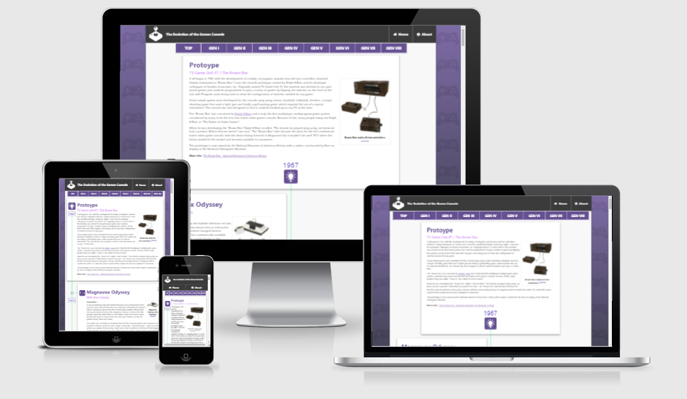
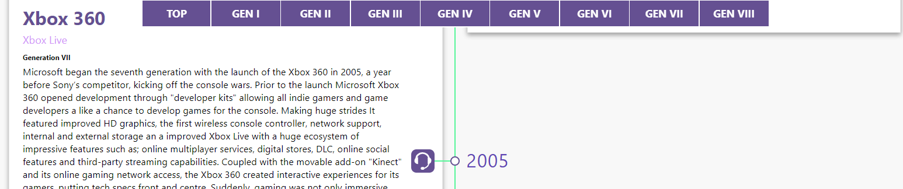

# The Evolution of Games Consoles

This site hopes to educate people on the history of the home video games console. This is done through an informative and detailed timeline which allows the user to effortlessly scroll through the history. 

This site has been designed with simple functionality for use with all audiences. This site splits up the consoles and compares them from one generation to the next. The site is dynamic and therefore accessible from any sized smart device with an internet connection.

The Evolution of Games consoles will be useful for anyone who is interested in the Home video games console market, it's history, development, innovations and failures allow for an an informative and educated read. Or for anyone who wants to experience and nostalgic trip back through the years.

### Existing Features

- __Navigation Bar__

  - Featured on two pages, the full responsive navigation bar includes links to the Home page and about page and is identical in each page to allow for easy navigation.
  - This section will allow the user to easily navigate from page to page across all devices without having to revert to the previous page via the ‘back’ button. 

- __The Timeline__

  - The Timeline is vertical allowing the user to scroll down for more content. Each entry on the timeline forks off into its own container featuring Text and Images.

- __Sticky Timeline Navbar__

  - The Sticky Timeline allows the user to navigate the Timline effectively without overscrolling to get to a require place e.g Top of page. The Sticky Navbar focuses on indidivual containers at the start of each new console generation. 
  - After scrolling beyond the sticky timelines initial starting position, the Timline continues to sit at the top of the browser allowing the user ease of access to quick navvigation 

- __The Footer__ 

  - The footer section includes links to the relevant social media sites of the creator. The links will open to a new tab to allow easy navigation for the user. 
  - The footer is valuable to the user as it encourages them to keep connected via social media

### Features Left to Implement

- About page: Not enough time to complete an about page. It would be used to inform the user of:
  - The goal and purpose of the site
  - Current features and when they were implemented
  - Future features
  - All references for any text, images and media used. 
  - Small bio about the creator of this site.

- Console Library: A library containing all Video games consoles ever released. This library would allow users to quickly find and select a console they wish to find more information on. Once clicked the user will be taken to a unique page for that console full of further information, images, videos and more about that console. The user will be easily able to navigate back and continue to browse the rest of the console selection in the library. The consoles will be seperated based on Manufacturer, but will all contain hyperlinks allowing for navigation between them.

- Hand-held consoles: Would like to expand upon the original site and integrate the history of Hand-held consoled.
- Peripherals: The evolution of the controllers and many peripherals.
- DRM & Storage medium: Like the two previous, this subject has a lot of interesting information that tied into and played a key role in the development of the Home Video Games Console 
- Redesign sticky navbar to be accomodated better on smaller devices. 

## Testing 

In this section, you need to convince the assessor that you have conducted enough testing to legitimately believe that the site works well. Essentially, in this part you will want to go over all of your project’s features and ensure that they all work as intended, with the project providing an easy and straightforward way for the users to achieve their goals.

In addition, you should mention in this section how your project looks and works on different browsers and screen sizes.

This project uses six media queries to allow for a dynamic website designed to fit and function on any size device:

  - Above 1330 px - Desktop Layout
  - 769px - 1330px - Tablet Layout (Similar to desktop layout).
  - 726px - 768px - Timeline enteries go from alternating left and right to all being on the right while the timline moves to the left of the screen.
  - 471px - 725px - Main navbar links moved below Logo and website name.
  - 421px - 470px - Large phone Layout - with side margins disappearing and navbar logo and title reducing in size.
  - 376px - 420px - Medium phone Layout - With decresing font size and weight of sticky navbar
  - Below 376px - Small Phone Layout - Sticky navbar reduced to smallest possible size.

### Validator Testing 

- HTML
  - No errors were returned when passing through the official [W3C validator](https://validator.w3.org/nu/?doc=https%3A%2F%2Fdybacz.github.io%2Fevolution-of-consoles%2F)

- CSS
  - No errors were found when passing through the official [(Jigsaw) CSS validator](https://jigsaw.w3.org/css-validator/validator?uri=https%3A%2F%2Fdybacz.github.io%2Fevolution-of-consoles%2F&profile=css3svg&usermedium=all&warning=1&vextwarning=&lang=en)

### Unfixed Bugs

- None as of yet.

### Deployment

- The site was deployed to GitHub pages. The steps to deploy are as follows: 
  - In the GitHub repository, navigate to the Settings tab 
  - From the source section drop-down menu, select the Master Branch
  - Once the master branch has been selected, the page will be automatically refreshed with a detailed ribbon display to indicate the successful deployment. 

## Credits 

### Code

 - [Codeinstitute](https://codeinstitute.net/)
 - [W3Schools](https://www.w3schools.com/html/)
 - [Mozilla MDN Web docs](https://developer.mozilla.org/en-US/docs/Web/HTML)
 - [Kevin Powell - Youtuber](https://www.youtube.com/kepowob)

### Content 

- The text for the the timeline was constructed and paraphrased from various places:

  - [Wikipedia](https://en.wikipedia.org/wiki/History_of_video_game_consoles)
  - [8-bit Central](http://www.8-bitcentral.com/index.html)
  - [Did.ie blog](https://www.did.ie/content/blog/history-of-video-game-consoles)
  - [Aarons blog](https://blog.aarons.com/lifestyle/history-of-gaming-consoles)
  - [Creative Colorado](https://creative.colorado.edu/~daho2353/dev/GamingHistory/)
  - [History](https://www.history.com/topics/inventions/history-of-video-games)
  - [BBC](https://www.bbc.co.uk/archive/the-8-generations-of-video-game-consoles/zvcjkty)

- The icons in the footer were taken from [Font Awesome](https://fontawesome.com/)
- The icons used in the timeline were available for free at [SVGrepo](https://www.svgrepo.com/)

### Media

- The images used on the timeline were taken from the consoles respective wikipedia site. All images were available for free download and personnel use.